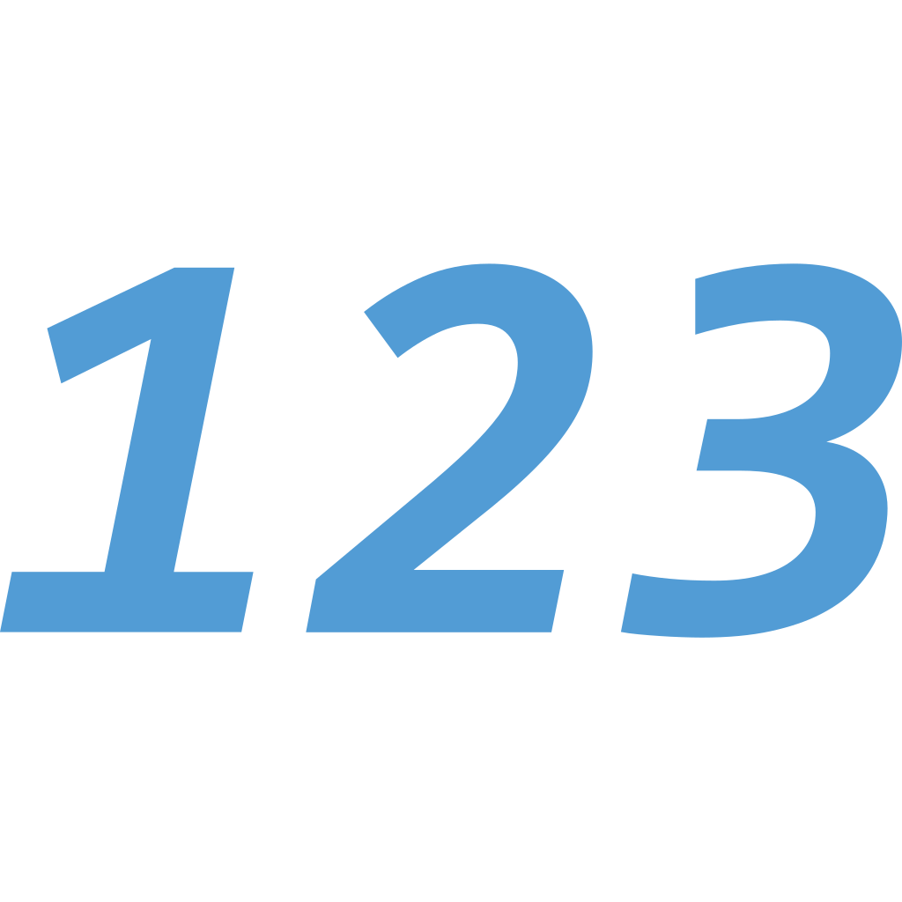
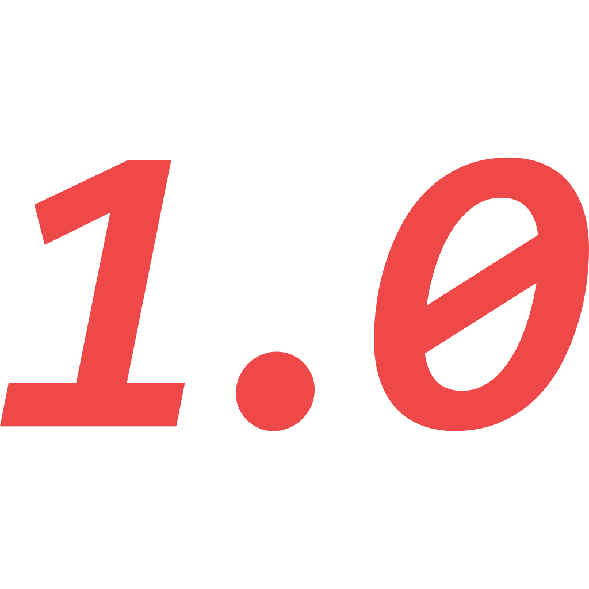
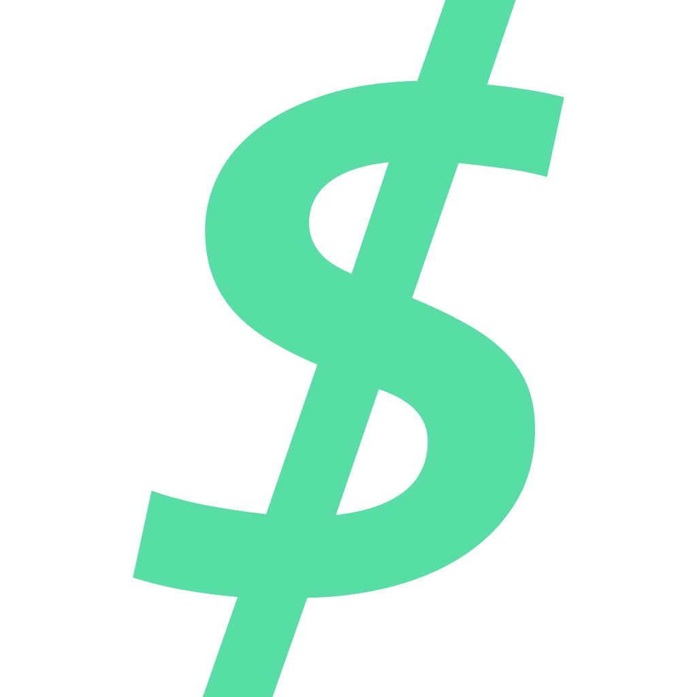

# Nodes

A node tree data structure represent a C# object graph. A node tree should never contain any cycles.

The node layer recognizes the following nodes listed below. Each node corresponds to a CSCD format literal, and vice-versa.

### Metadata

-   **Address**: a reference address, used to mark shared or cyclic reference objects.
-   **Type**: a type label, used to disambiguify polymorphic types.
-   **Scope**: a class/struct member scope, used to disambiguify shadowed fields and properties.
-   **Offset**: a UTC time offset, used to add timezone information to a timestamp node.

### Primitives

-   **Null**: encodes a null value in an object graph.
-   **Bool**: encodes a boolean value. Can be either `true` or `false`.
-   **Int**: encodes an integer value of arbitrary precision. Can be used for both signed and unsigned integers.
-   **Float**: encodes a floating-point value of arbitrary precision.
-   **Infinity**: encodes a positive or negative infinity value, such as `float.PositiveInfinity` and `double.NegativeInfinity`.
-   **Nan**: encodes a NaN value, such as `float.NaN` and `double.NaN`.
-   **Char**: encodes a character value. May be any Unicode character.
-   **String**: encodes a string value.
-   **Decimal**: encodes a decimal value of arbitrary precision, composed of a sign, mantissa and range. Unlike float nodes, it preserves trailing zeros after the decimal point.
-   **Color**: encodes a color value, composed of a red, green, blue and alpha byte.
-   **UID**: encodes a unique identifier as a 128-bit number.
-   **Timestamp**: encodes a timestamp value, composed of a year, month, day, hour, minute and second. The year may be negative, the other terms must be positive.
-   **Duration**: encodes a duration value, composed of a number of days, hours, minutes, seconds and a sign. All terms must be positive.
-   **Bytes**: encodes a byte array value; used to store arbitrary binary data.
-   **Symbol**: encodes enums and special constants (such as the mathematical constants `pi` and `e`).
-   **Ref**: a reference to an address node. Used to avoid duplication of shared references, and cycles in cyclic references.

### Collections

-   **List**: a collection node that contains a list of element nodes. Used to encode arrays-like or set-like types.
-   **Dict**: a collection node that contains pairs of key/value nodes. Used to encode dictionary-like types.
-   **Object**: a collection node that contains pairs of member name strings and member value nodes. Used to encode arbitrary object instances.
