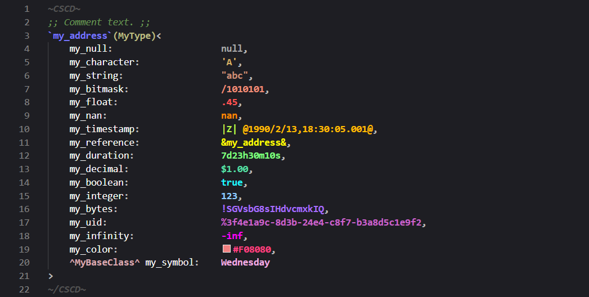

# CSCD Syntax Highlighting

This is a Visual Studio Code plugin that enables syntax highlighting for the CSCD format.

**Installation**:
- Download `build\cscd.vsix`
- Open Visual Studio Code.
- Press `Ctrl + Shift + X`
- Select the `...` button.
- Select `Install from VSIX...`.
- Choose `cscd.vsix` in the file window.

  

